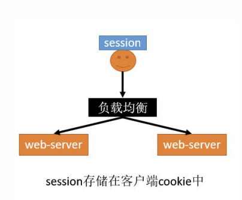

## Session 共享问题

1. 原始单机版本

   

### 分布式下 session 共享问题

1. session 复制

   

   - 优点: tomcat 原生支持, 只需要简单的配置
   - 缺点
     1. session 同步需要数据传输, 占用大量带宽, 降低了服务器群的业务处理能力
     2. 任意一台 web-server 的 session 数据时所有的和, 受内存限制

2. ~~客户端存储~~

   

   - 优点: 服务器不需要存储 session, 用户保存自己的 session 在 cookie 中
   - 缺点
     1. 每次请求用户都带有自己的完整信息, 浪费带宽
     2. session 的数据放在 cookie 中有长度限制[4k]
     3. session 数据放在 cookie 中, **存在泄露篡改, 窃取等安全问题**

3. hash 一致性

   

   - 优点:
     1. 只需要改 nginx 配置, 不需要修改应用代码
     2. 负载均衡, 只要 hash 属性的值分布是均匀的, 多台 web-server 的负载是均衡的
     3. 可以支持 web-server 水平扩展[session 同步法是不行的, 受内存限制]
   - 缺点:
     1. session 还是存在 web-server 中的, 所以 web-server 重启可能导致部分 session 丢失，影响业务
     2. 如果 web-server 水平扩展, rehash 后 session 重新分布, 也会有一部分用户路由不到正确的 session
   - 总结: `但是以上缺点问题也不是很大, 因为session本来都是有有效期的, 所以这两种反向代理的方式可以使用`

4. 统一存储

   

   - 优点:

     1. 没有安全隐患
     2. 可以水平扩展，数据库/缓存水平切分即可
     3. web-server 重启或者扩容都不会有 session 丢失

   - 不足
     1. 增加了一次网络调用，并且需要修改应用代码: `如将所有的getSession方法替换为从Redis查数据的方式`
     2. redis 获取数据比内存慢很多
     3. 上面缺点可以用 SpringSession 完美解决

### 不同服务, 子域 session 共享

1. jsessionid 这个 cookie 默认是当前系统域名的
2. 当我们分拆服务, 不同子域名部署的时候,可以使用如下解决方案

   - 会员服务: `a.guli.com`
   - 订单服务:`b.guli.com`
   - 订单服务:`c.guli.com`

   
